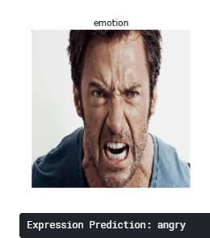

# Emotion-Prediction-Deployment

## Objective:
* Create model that will predict emotions using facial expression.
* Gain my end-to-end experience in learning about and being able to create models.
* Create strong documentation

## Data:
* Data source: https://www.kaggle.com/ahmedmoorsy/facial-expression

## Technology used:
* Python, Keras , Flask,HTML, CSS & Heroku

## Sample Output:

